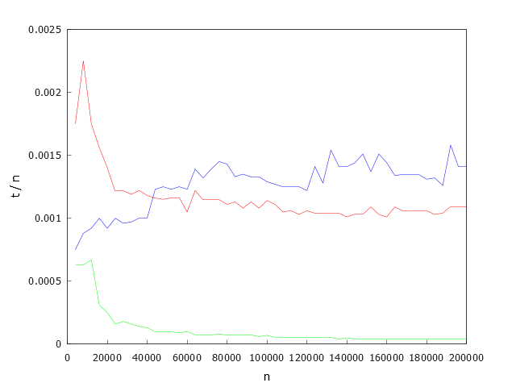
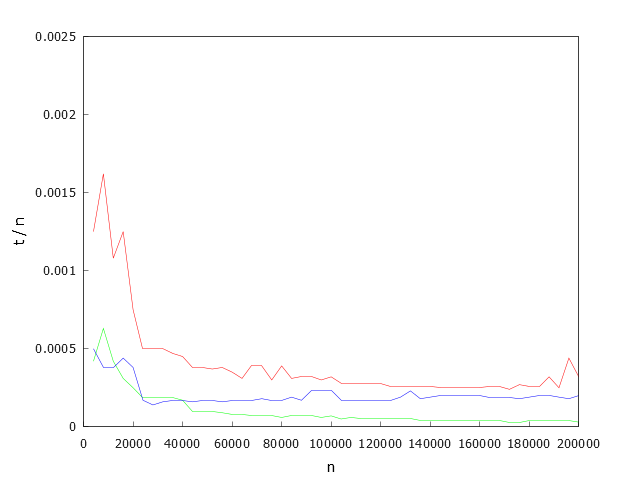
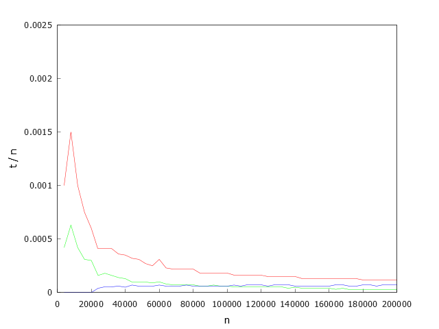
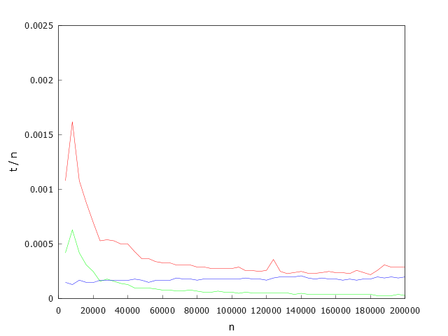
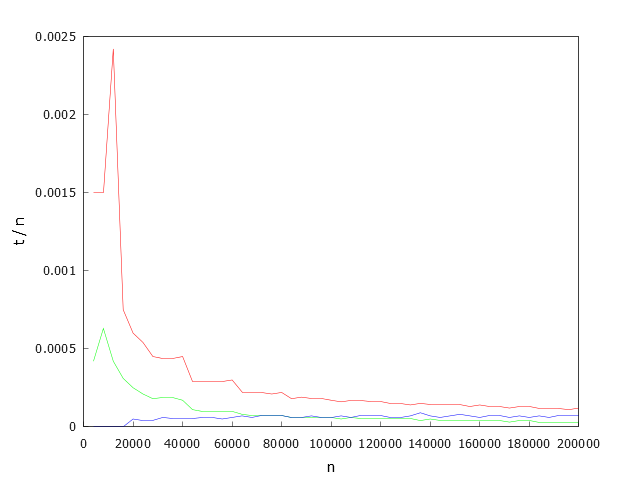
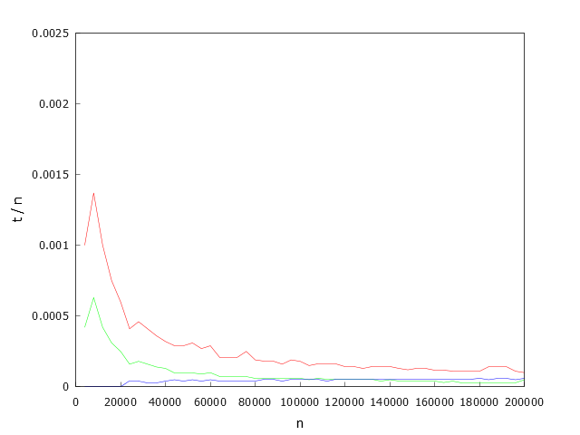
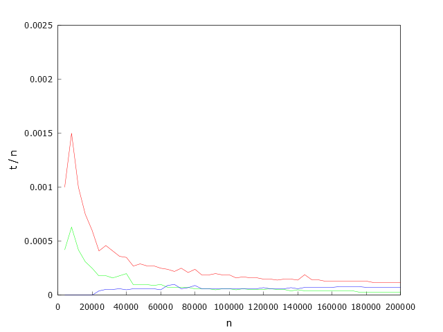
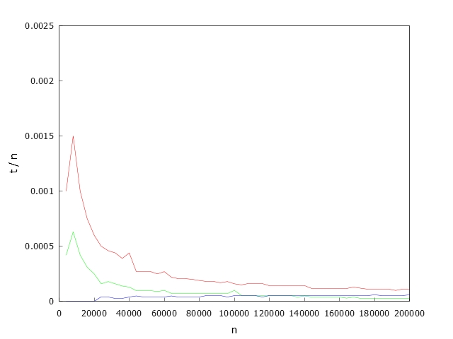
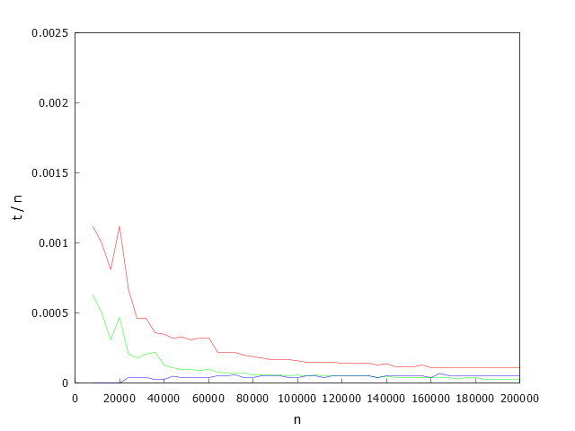

Тестирующая программа: 

Ниже представлены графики времени работы решений в зависимости от n - количества посещений и коэффициентов k и p, где k = m / M (m - количество уникальных номеров столовых в тесте, M - наибольший номер столовой), p = n / M.

Зеленый график - время работы(t / n) решения 1, не используещего hash таблицу.

Красный график - время работы(t / n) решения 2, использующего hash-таблицу, с резервированием изначальной емкости unordered set до 200000.

Синий график - время работы(t / n) решения 2, использующего hash-таблицу, без резервирования.

k = 1, p = 1

k = 1/8, p = 1  

k = 1/64, p = 1

k = 1, p = 8

k = 1/8, p = 8

k = 1/64, p = 8

k = 1, p = 64

k = 1/8, p = 64

k = 1/64, p = 64

Для решений №1 и №2(с предв. хэшированием) характер зависимости схож с гиперболой, для решения №2(без предв. хэширования) характер зависимости более походит на линейный, умноженный на константу, зависщую от n.

Несложно заметить, что в общем случае быстрее всех работает решение, не использующее hash-таблицу, независимо от коэффициентов k и p время работы мало по сравнению с другими решениями и находится примерно на одном уровне.

Если сравнить решение №2 с предварительным перехэшированием и без, то можно заметить, что предварительное перехэширование unordered set заметно улучшает ситуацию в случае, когда в тесте много уникальных значений (>40000). Когда уникальных значений мало, нет необходимости в предварительном перехэшировании, т.к. время, затрачиваемое на это действие неоправдано, ведь коллизий при добавлении элементов в hash таблицу будет немного.

Можно сделать вывод:

1. Для данных с количеством уникальных значений(<40000) лучше использовать решение, №2 без предварительного хэширования.

2. Для решений в общем случае, когда мы не знаем, какие конкретно тестовые данные получим, лучше использовать решение №1.

